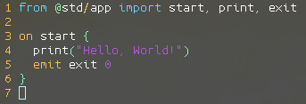
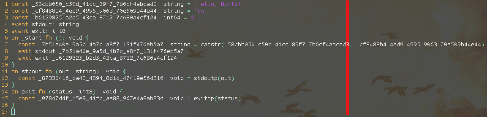
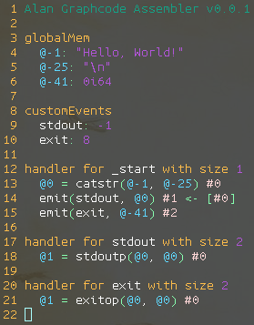

# vim-alan

Syntax highlighting for the [Alan Programming Language](https://alan-lang.org).

## Installation

vim-alan follows the standard runtime path structure. Below are some helper lines for popular package managers:

* [Vim 8 Packages](http://vimhelp.appspot.com/repeat.txt.html#packages)
  * `git clone https://github.com/alantech/vim-alan ~/.vim/pack/plugins/start/vim-alan`
* [Pathogen](https://github.com/tpope/vim-pathogen)
  * `git clone https://github.com/alantech/vim-alan ~/.vim/bundle/vim-alan`
* [vim-plug](https://github.com/junegunn/vim-plug)
  * `Plug 'alantech/vim-alan'`
* [Vundle](https://github.com/VundleVim/Vundle.vim)
  * `Plugin 'alantech/vim-alan'`

## Examples

This package provides syntax highlighting for Alan's `ln` source files, as well as the Alan-- `amm` intermediate format and the Alan Graphcode Assembler `aga` intermediate format.

### ln

### amm

## aga

## License

Apache 2.0
